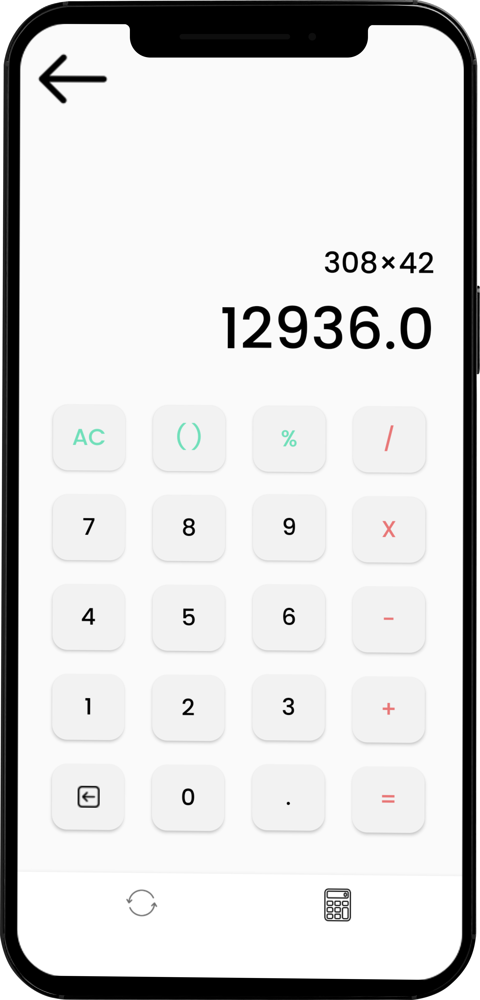

<!-- PROJECT LOGO -->
 

  

<h3 align="center">Convert It</h3>

  

Convert It is an android application which performs the functions of a basic calculator and unit converter. The simple user interface allows for quick and easy conversions from a number in one unit to another.  

<!-- TABLE OF CONTENTS -->

  
Table of Contents

  <ol>
    <li>
      <a href="#about">About The Project</a>
      <ul>
        <li><a href="#built-with">Built With</a></li>
      </ul>
    </li>
    <li><a href="#features">Features</a></li>
      <li><a href="#demo">Demo</a></li>
    <li><a href="#contributing">Contributing</a></li>
    <li><a href="#contact">Contact</a></li>
    <li><a href="#acknowledgments">Acknowledgments</a></li>
  </ol>

  
<!-- ABOUT THE PROJECT -->
## About The Project
  
[![About][screenshot]](https://github.com/paulineona/ConvertIt)

(<a href="#top">back to top</a>)

Available unit conversions include:
* Length (Meter, Kilometer, Inches, Feet, Yard)
* Volume (Milliliter, Liter, US Gallon, Pint, Ounce)
* Mass/Weight (Milligrams, Grams, Kilograms, Metric Tons, Pounds)
* Area (Square Meter, Square Feet, Square Yards, Acres, Hectares)
* Time (Hours, Minutes, Seconds)

  

### Built With

* [Android Studio](https://developer.android.com/)
* [Java](https://www.java.com/en/)

(<a href="#top">back to top</a>)

  

  
<!-- FEATURES -->
## Features

* No internet connection is required. All conversions can be calculated offline.
* The conversion results appear instantly while entering the input data.
* The conversion values are up to Million only.
* The unit conversion is based on data retrieved from <a href="https://www.google.com/">Google</a> and <a href="https://www.inchcalculator.com/">Inch Calculator</a>.
* The standard calulator offers basic operations and evaluates commands immediately as they are entered.
  

  
  
  

  

  

  

   

  

  

  

   

  

  

(<a href="#top">back to top</a>)

  

  
<!-- DEMO -->
## Demo
  
* <a href="https://youtu.be/P7sXY7sx-w4">Link for the demo video of the Convert It</a>
  

(<a href="#top">back to top</a>)

  

  
<!-- CONTRIBUTING -->
## Contributing

Contributions are what make the open source community such an amazing place to learn, inspire, and create. Any contributions you make are **greatly appreciated**.

If you have a suggestion that would make this better, please fork the repo and create a pull request. You can also simply open an issue with the tag "enhancement".
Don't forget to give the project a star! Thanks again!

1. Fork the Project
2. Create your Feature Branch (`git checkout -b feature/ConvertIt`)
3. Commit your Changes (`git commit -m 'Add some ConvertIt'`)
4. Push to the Branch (`git push origin feature/ConvertIt`)
5. Open a Pull Request

(<a href="#top">back to top</a>)

  
<!-- CONTACT -->
## Contact

* Jefferson Caulawon- jefferson.caulawon@g.batstate-u.edu.ph
* Kristia Isabelle Samson - kristiaisabelle.samson@g.batstate-u.edu.ph
* Pauline Mae Ona - paulinemae.ona@g.batstate-u.edu.ph

Project Link: [https://github.com/paulineona/ConvertIt](https://github.com/paulineona/ConvertIt)

(<a href="#top">back to top</a>)

  
<!-- ACKNOWLEDGMENTS -->
## Acknowledgments

* [Flaticon](https://www.flaticon.com/)
* [Behance](https://www.behance.net/)
* [Dribble](https://dribbble.com/)

(<a href="#top">back to top</a>)

<!-- MARKDOWN LINKS & IMAGES -->
[screenshot]: screenshots/about2.png

